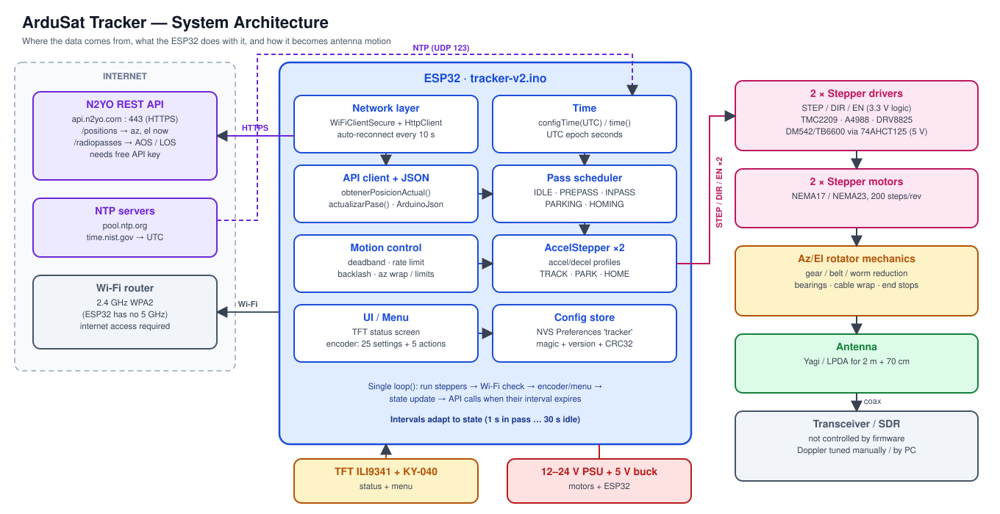
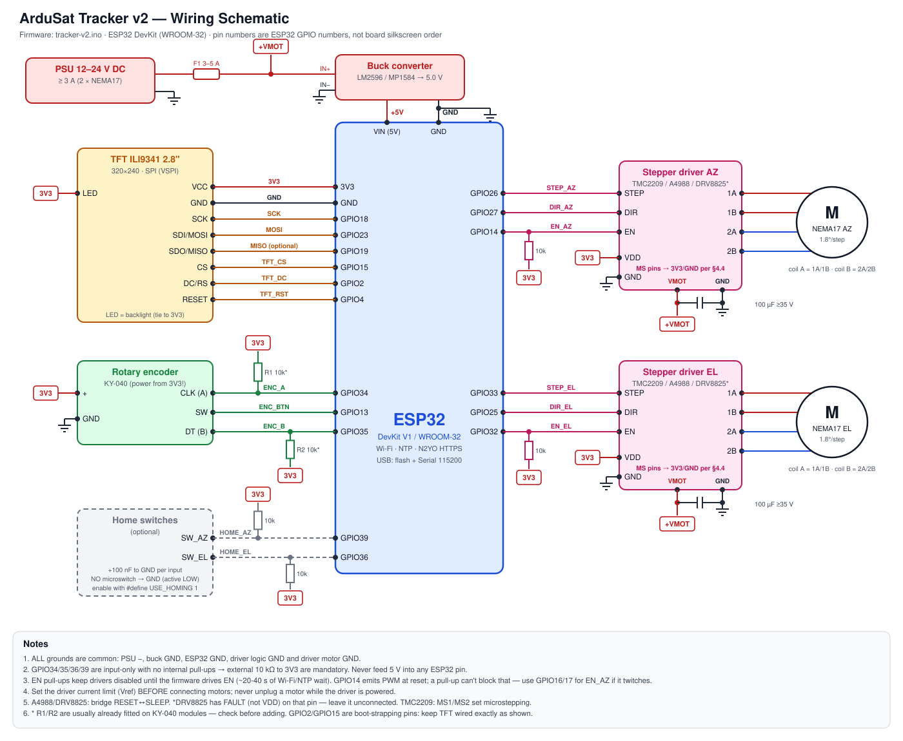
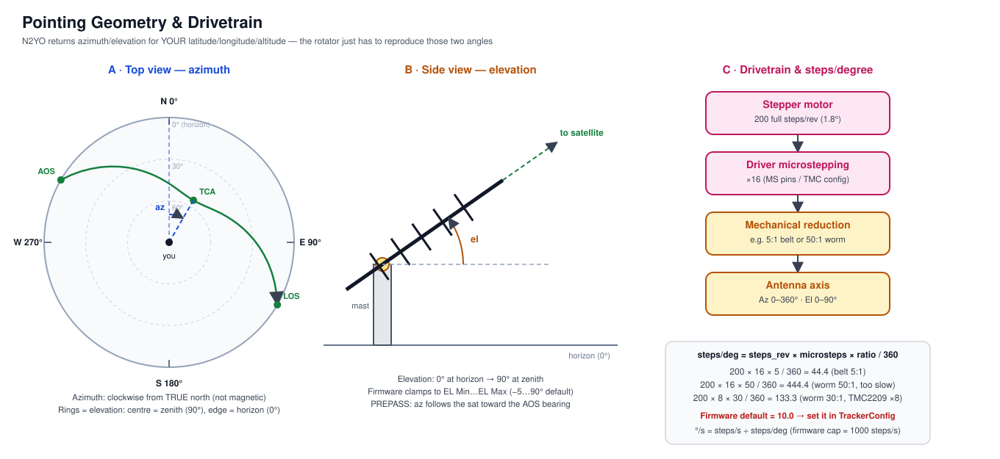
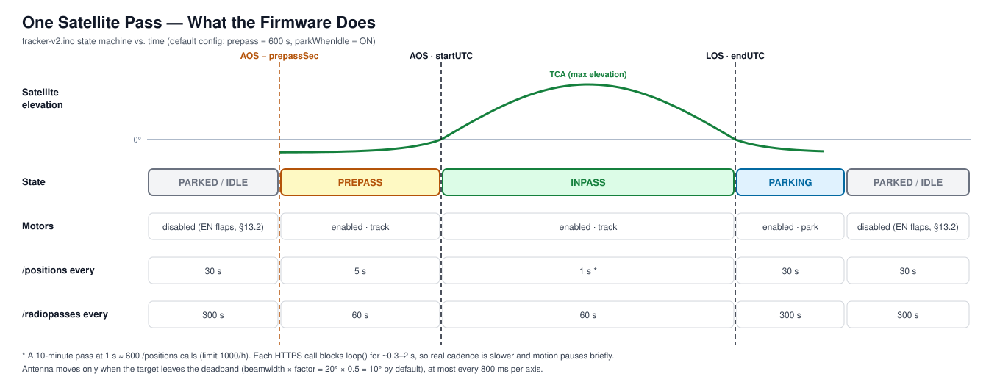
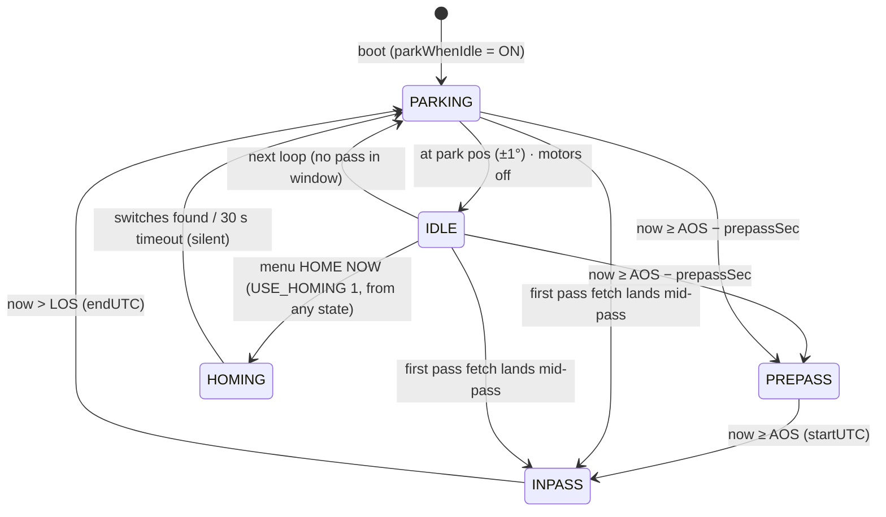
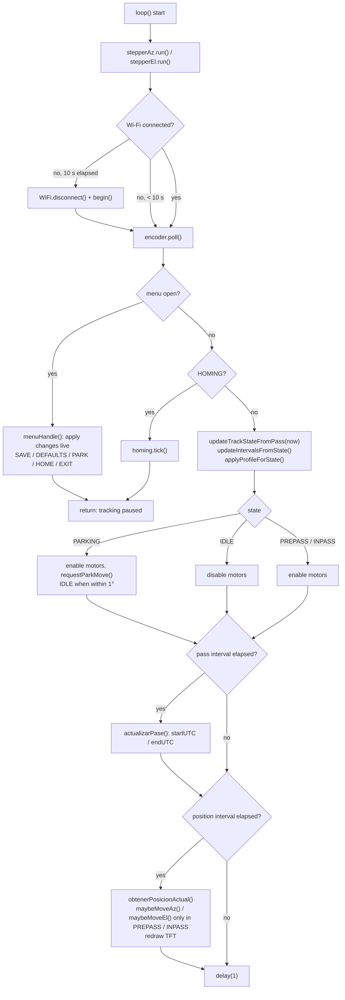
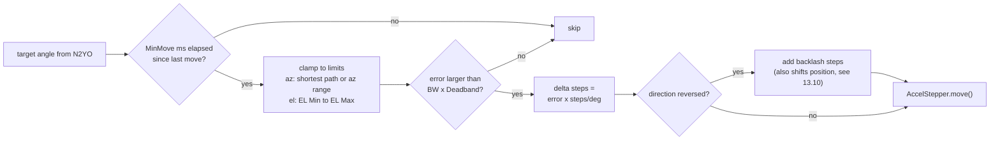

# ArduSat Tracker — Build & Operation Guide

> An ESP32 rotator controller that points a ham-radio antenna at a satellite and follows it across the sky.
> This guide covers **what the project is**, **what to buy**, **how to wire and build it**, **how to configure and flash it**, and **how to use it on a real satellite pass**.

| | |
|---|---|
| **Firmware covered** | `tracker-v2.ino` (recommended) · `ardusat-tracker.ino` (v1, legacy) |
| **Controller** | ESP32 DevKit (WROOM-32) |
| **Data source** | [N2YO REST API](https://www.n2yo.com/api/) (internet required) |
| **Satellites** | ISS, SO-50, AO-123, RS-44, FO-29, AO-7, Meteor-M, … see the **[Satellite Catalogue](SATELLITES.md)** |
| **Motors** | 2 × stepper (STEP/DIR drivers) — azimuth + elevation |
| **UI** | 2.8" ILI9341 TFT + KY-040 rotary encoder with push button |
| **Audience** | Amateur-radio operators (LEO satellites: FM birds, ISS, APRS, weather) |

---

## Table of contents

1. [How it works (the 60-second version)](#1-how-it-works-the-60-second-version)
2. [System architecture](#2-system-architecture)
3. [Bill of materials — what you need](#3-bill-of-materials--what-you-need)
4. [Wiring schematic & pin map](#4-wiring-schematic--pin-map)
5. [Mechanics: building the az/el rotator](#5-mechanics-building-the-azel-rotator)
6. [Firmware: install, configure, flash](#6-firmware-install-configure-flash)
7. [First power-up & calibration](#7-first-power-up--calibration)
8. [Operating it: tracking a real pass](#8-operating-it-tracking-a-real-pass)
9. [On-device menu reference](#9-on-device-menu-reference)
10. [Firmware internals](#10-firmware-internals)
11. [N2YO API budget](#11-n2yo-api-budget)
12. [Troubleshooting](#12-troubleshooting)
13. [Known limitations & recommended improvements](#13-known-limitations--recommended-improvements)
14. [v1 vs v2](#14-v1-vs-v2)
15. [Safety checklist](#15-safety-checklist)
16. [Glossary](#16-glossary)

---

## 1. How it works (the 60-second version)

Think of the tracker as **a GPS navigator for your antenna**. A navigator doesn't compute the roads itself; it asks a map service for the route, then tells you to turn left or right. The tracker works the same way:

1. **Ask where the satellite is.** Over Wi-Fi, the ESP32 asks N2YO: *"For an observer at latitude X, longitude Y and altitude Z, where is satellite #25544 right now?"* N2YO answers with two angles: **azimuth** (compass direction) and **elevation** (height above the horizon).
2. **Ask when it will be visible.** A second request (`/radiopasses`) returns the next pass: **AOS** (rise time) and **LOS** (set time).
3. **Decide what to do.** A small state machine decides whether to stay parked, pre-position for an upcoming pass, actively track, or go back to park.
4. **Move the antenna.** Two stepper motors (one for azimuth, one for elevation) turn the angles into motion. AccelStepper handles smooth acceleration.
5. **Show status.** The TFT shows target vs. current angles, the satellite name, the pass state and a countdown. A rotary encoder opens a settings menu, and settings are saved to flash.

> **What it does *not* do:** it does not control your radio. Doppler correction, mode and frequency are up to you (see [§8.4](#84-radio-side-doppler--frequencies)).

---

## 2. System architecture



| Layer | Responsibility | Code |
|---|---|---|
| **Network** | Wi-Fi station mode, HTTPS client to `api.n2yo.com:443`, reconnect every 10 s | `connectWiFi()`, `loop()` |
| **Time** | NTP sync to UTC (`pool.ntp.org`, `time.nist.gov`) so pass times can be compared with "now" | `syncNTP()` |
| **API client** | Builds N2YO URLs, parses JSON with ArduinoJson | `obtenerPosicionActual()`, `actualizarPase()` |
| **Pass scheduler** | `IDLE / PREPASS / INPASS / PARKING / HOMING` state machine, adaptive polling | `updateTrackStateFromPass()`, `updateIntervalsFromState()` |
| **Motion control** | Deadband, per-axis rate limit, backlash compensation, az wrap / limits, el clamp | `maybeMoveAz()`, `maybeMoveEl()`, `requestParkMove()` |
| **Actuation** | Two `AccelStepper` instances (DRIVER mode), three motion profiles | `applyMotionProfile()` |
| **UI** | TFT status screen, encoder-driven menu with 25 settings + 5 actions | `menuRender()`, `menuHandle()` |
| **Persistence** | `TrackerConfig` struct saved to NVS (`Preferences`, namespace `tracker`) with magic, version and CRC32 | `loadConfig()`, `saveConfig()` |

---

## 3. Bill of materials — what you need

A machine-readable copy is in [`BOM.csv`](BOM.csv).

### 3.1 Electronics

| # | Item | Qty | Recommended spec | Notes |
|---|---|---|---|---|
| E1 | ESP32 dev board | 1 | ESP32-WROOM-32 "DevKit V1" (30 or 38 pin) | Must be classic ESP32 (the pin map uses GPIO 34/35/36/39). S2/S3/C3 need a new pin map. |
| E2 | TFT display | 1 | 2.8" ILI9341 SPI, 320×240 (touch optional, unused) | Make sure it runs on 3.3 V logic. Most red "2.8 TFT SPI" boards do. |
| E3 | Rotary encoder | 1 | KY-040 module (CLK, DT, SW, +, GND) | Power it from **3.3 V**, not 5 V. |
| E4 | Stepper drivers | 2 | **TMC2209** (quiet, recommended), A4988 or DRV8825. External DM542/TB6600 for NEMA23. | STEP/DIR/EN interface. See §4.4 for external drivers. |
| E5 | Stepper motors | 2 | NEMA17, 1.8°, 40–60 N·cm, ≤ 1.7 A (light antennas). NEMA23 for heavier arrays. | Torque needed depends on the gear ratio (§5). |
| E6 | Motor PSU | 1 | 12 V (A4988) or 24 V (TMC2209/DRV8825), ≥ 3 A | Higher voltage gives better high-speed torque. Stay under the driver's VMOT max. |
| E7 | Buck converter | 1 | LM2596 or MP1584, adjustable, set to **5.0 V** before connecting | Feeds the ESP32 `VIN` pin. |
| E8 | Bulk capacitors | 2 | 100 µF ≥ 35 V electrolytic | One per driver, across VMOT–GND, as close as possible to the driver. |
| E9 | Resistors | 4–6 | 10 kΩ ¼ W | EN pull-ups (2), encoder pull-ups if not on module (2), home-switch pull-ups (2, optional). |
| E10 | Fuse + holder | 1 | 3–5 A blade or glass | On the PSU + output. |
| E11 | Home/limit switches (optional) | 2 | NO micro-switch with lever | Only if `USE_HOMING 1`. Add a 100 nF capacitor per input. |
| E12 | Misc | — | Perfboard or PCB, JST/screw terminals, 22 AWG wire (motors 20 AWG), heat-shrink, IP65 enclosure | Use shielded cable for long motor runs. |
| E13 | Level shifter | 1 | 74AHCT125 (5 V) | Only for opto-isolated DM542/TB6600 drivers (§4.4). |

### 3.2 Mechanical (see [§5](#5-mechanics-building-the-azel-rotator))

| # | Item | Notes |
|---|---|---|
| M1 | Azimuth bearing | Lazy-Susan / slewing ring or tapered-roller bearing. It takes the full antenna weight. |
| M2 | Elevation axle + bearings | 2 × pillow-block bearings (e.g. KP08) and an 8 mm shaft or tube cross-boom. |
| M3 | Reduction, each axis | Worm gear (self-locking, recommended for EL), GT2 belt + pulleys (e.g. 20T→100T = 5:1), or a planetary-geared NEMA17. |
| M4 | Mast, tripod or base | Rated for wind load. Ground it. |
| M5 | Counterweight | Balances the antenna around the elevation axis. |
| M6 | Cable management | Drip loops, cable wrap or slip ring for azimuth, strain relief. |

> **Reference design:** the open-source [SatNOGS rotator](https://wiki.satnogs.org/SatNOGS_Rotator_v3) solves the same mechanical problem with steppers and worm gears. Its mechanics pair well with this firmware.

### 3.3 RF / operating

| # | Item | Notes |
|---|---|---|
| R1 | Antenna | Dual-band 2 m / 70 cm Yagi (e.g. handheld "Arrow"-type) or an LPDA. Know its −3 dB beamwidth (§9). |
| R2 | Radio | Dual-band FM transceiver (full-duplex preferred) or an SDR for receive-only. |
| R3 | Coax | Low-loss and flexible enough to survive rotation. Leave a service loop. |
| R4 | Optional | Diplexer, LNA, 67 Hz CTCSS capability (SO-50) |

### 3.4 Accounts and software

* **N2YO account + API key:** free, generated from your N2YO profile page.
* **2.4 GHz Wi-Fi with internet access** at the antenna site. The ESP32 cannot use 5 GHz networks.
* **Arduino IDE 2.x** (or `arduino-cli`) with the ESP32 core (§6).
* **Amateur-radio licence** to transmit. Receiving (ISS, weather, APRS) usually needs none, but check your local rules.

---

## 4. Wiring schematic & pin map



### 4.1 Pin map (`tracker-v2.ino`)

| Function | Firmware symbol | ESP32 GPIO | Connects to | Electrical notes |
|---|---|---|---|---|
| TFT chip select | `TFT_CS` | **15** | ILI9341 `CS` | Strapping pin. Fine as CS. |
| TFT data/command | `TFT_DC` | **2** | ILI9341 `DC/RS` | Strapping pin. Must be LOW/floating only when entering download mode (flashing). |
| TFT reset | `TFT_RST` | **4** | ILI9341 `RESET` | |
| SPI clock | *(VSPI default)* | **18** | ILI9341 `SCK` | Hardware SPI, not set in code. |
| SPI MOSI | *(VSPI default)* | **23** | ILI9341 `SDI/MOSI` | |
| SPI MISO | *(VSPI default)* | **19** | ILI9341 `SDO/MISO` | Optional (display read-back only). |
| Az step | `STEP_AZ` | **26** | Az driver `STEP` | |
| Az direction | `DIR_AZ` | **27** | Az driver `DIR` | Swap motor coil pair *or* re-wire if direction is reversed. |
| Az enable | `EN_AZ` | **14** | Az driver `EN` | GPIO14 emits PWM briefly at reset, which a pull-up can't block. The 10 kΩ pull-up keeps the driver off during the 20–40 s Wi-Fi/NTP wait, before `setEnablePin()` runs. If the az motor twitches at boot, move EN_AZ to GPIO16/17. |
| El step | `STEP_EL` | **33** | El driver `STEP` | |
| El direction | `DIR_EL` | **25** | El driver `DIR` | |
| El enable | `EN_EL` | **32** | El driver `EN` | 10 kΩ pull-up. |
| Encoder A | `ENC_A` | **34** | KY-040 `CLK` | **Input-only, no internal pull-up.** Needs an external 10 kΩ to 3V3. |
| Encoder B | `ENC_B` | **35** | KY-040 `DT` | **Input-only, no internal pull-up.** Needs an external 10 kΩ to 3V3. |
| Encoder button | `ENC_BTN` | **13** | KY-040 `SW` | Uses the internal `INPUT_PULLUP`. Active LOW. |
| Home switch Az | `HOME_AZ_PIN` | **39** | Switch to GND | Optional. Input-only, needs an external pull-up. |
| Home switch El | `HOME_EL_PIN` | **36** | Switch to GND | Optional. Input-only, needs an external pull-up. |
| 5 V in | — | **VIN** | Buck converter 5 V out | Or power via USB while on the bench. |
| Logic 3.3 V | — | **3V3** | TFT VCC/LED, encoder +, driver VDD, pull-ups | ESP32 on-board LDO (~500 mA budget shared with Wi-Fi). |

### 4.2 Power distribution

```
            F1 3–5 A
 PSU + ──────[▭]──────┬──────────────► VMOT  Az driver  (+100 µF to GND)
 12–24 V              ├──────────────► VMOT  El driver  (+100 µF to GND)
                      └──► Buck IN+ ── Buck OUT 5.0 V ──► ESP32 VIN
 PSU − ───────────────┴──────────── common GND (buck, ESP32, both drivers)
                                     ESP32 3V3 ──► TFT, encoder, driver VDD, pull-ups
```

Rules of thumb:

* **One common ground.** Without it, STEP pulses have no reference and motors stutter or don't move.
* **Set the buck to 5.0 V with a multimeter *before* connecting the ESP32.**
* **Never connect or disconnect a motor while the driver is powered.** The inductive spike destroys A4988/DRV8825 chips.
* Keep motor wires away from the TFT SPI lines. Twist each coil pair.

### 4.3 Setting driver current (Vref)

Set the current limit to roughly **70 % of the motor's rated phase current** and check motor temperature after 10 minutes. Below 60 °C is fine.

| Driver | Typical formula | Example (1.5 A motor → 1.05 A) |
|---|---|---|
| A4988 (Pololu-style, Rs = 0.068 Ω) | `I = Vref / (8 × Rs)` → `Vref ≈ I × 0.544` | Vref ≈ 0.57 V |
| DRV8825 | `I = Vref × 2` | Vref ≈ 0.53 V |
| TMC2209 (standalone) | Board-specific, see your module's datasheet (often `Irms ≈ Vref × 0.71`). **This sets RMS current** (peak = RMS × 1.41). | 1.05 A **peak** ≈ 0.74 A RMS → Vref ≈ 1.05 V |

> Formulas depend on the sense resistor fitted on *your* board. Check the vendor page. A4988/DRV8825 formulas set **peak** current. Motor datasheets usually give the rated current per phase as RMS or peak, so check which.

### 4.4 Driver-specific notes

* **A4988 / DRV8825:** bridge `RESET` ↔ `SLEEP`. Microstepping is set by `MS1–MS3` (A4988) or `M0–M2` (DRV8825). EN is active LOW (the menu default `EN active LOW = ON` matches).
* **TMC2209 (standalone STEP/DIR):** `MS1/MS2` select 8/16/32/64 microsteps. EN is active LOW. UART is not used by this firmware.
* **External opto-isolated drivers (DM542, TB6600):** inputs are usually specified for 5 V. Drive `PUL+`, `DIR+` and `ENA+` from the ESP32 through a **74AHCT125** level shifter (or use the driver's 24 V/5 V jumper per its manual), and tie `PUL−`, `DIR−` and `ENA−` to GND. On these drivers ENA *disables* the motor when its opto is energised, so with this wiring the default `EN active LOW = ON` is already correct: firmware "enable" = LOW = opto off = motor enabled.
* **STEP pulse width:** the firmware never calls `setMinPulseWidth()`, so AccelStepper uses its default ~1 µs pulse. That is below the DRV8825 minimum (1.9 µs) and the DM542/TB6600 minimum (≥ 2.5 µs, plus ≥ 5 µs DIR set-up). For those drivers, add `stepperAz.setMinPulseWidth(3);` (DRV8825) or `(5)` (DM542/TB6600) for both axes in `setup()`.
* **Microstepping changes steps/degree.** Recompute it (§5.3) after every jumper change.

---

## 5. Mechanics: building the az/el rotator



### 5.1 The two axes

* **Azimuth (az):** rotation around the vertical axis. 0° = **true north**, increasing clockwise (90° E, 180° S, 270° W). This is what N2YO returns.
* **Elevation (el):** tilt above the horizon. 0° = horizon, 90° = straight up (zenith).

The azimuth stage sits on the mast. The elevation stage rides on top of it, and the antenna boom is fixed to the elevation axle.

### 5.2 Design guidelines that matter in real life

1. **Balance the elevation axis.** Put the elevation axle through the antenna's centre of gravity, or add a counterweight. An unbalanced boom needs far more torque and back-drives the motor.
2. **Use a self-locking reduction on elevation (worm gear).** In `IDLE` the firmware *disables the motors* (`enableMotors(false)`). With a belt drive the antenna can sag or rotate in the wind while unpowered. The firmware never notices, so every later pass is mis-pointed. A worm gear holds position with zero power.
3. **Choose the gear ratio for resolution *and* speed** (see §5.3):
   * more ratio → more torque and resolution, but a lower top speed in °/s;
   * LEO satellites move at most a few °/s except near zenith (§13.6). Aim for **≥ 5 °/s** on azimuth and **≥ 2 °/s** on elevation.
   * The firmware tops out at **about 1000 steps/s per axis** (§13.9), so keep `steps/deg ≤ ~150` if you want 5 °/s. Lower the microstepping rather than the gear ratio.
4. **Plan the cable path.** Coax and motor cables must survive the full azimuth range. Either limit azimuth (`azContinuous = false`) or use a slip ring for power/control and a rotary-tolerant coax loop.
5. **Weatherproof** the electronics enclosure (IP65), use drip loops, and protect the TFT behind a window or keep it indoors on a cable.
6. **Wind load.** Even a small Yagi can catch enough wind to skip steps. Size the motor torque with margin (≥ 2×) and secure the mast.

### 5.3 Computing `Steps/deg`

```
steps_per_degree = motor_steps_per_rev × microsteps × gear_ratio / 360
```

| Configuration | Steps/deg | Speed at default `TR MaxSpd = 800 st/s` (firmware cap ≈ 1000 st/s) |
|---|---|---|
| Direct drive, 200 × 16 | 8.9 | 90 °/s (too little torque for most antennas) |
| GT2 belt 20T→100T (5:1), ×16 | **44.4** | 18 °/s |
| Worm 30:1, ×16 | 266.7 | 3.0 °/s |
| Worm 50:1, ×16 | 444.4 | 1.8 °/s. Too slow for azimuth, and raising `TR MaxSpd` won't help (§13.9). |
| Worm 50:1, **×4** | **111.1** | 7.2 °/s ✅ (self-locking el, adequate az) |

> **The firmware default is `10.0` steps/deg.** That is almost certainly wrong for your build. Set `stepsPerDegAz/El` in `TrackerConfig` and flash, then use menu `DEFAULTS` → `SAVE`. Each menu click only changes it by 0.1, so use the menu for fine trimming only.

**Top speed check:** `max °/s = min(TR MaxSpd, ~1000) / Steps/deg`. `loop()` calls `stepper.run()` once per iteration and ends with `delay(1)`, so each axis gets at most ~1000 steps/s. HTTPS calls and TFT redraws pause it further (§13.1). Settings above ~1000 st/s, including the 2500 st/s homing default, are not reached.

---

## 6. Firmware: install, configure, flash

### 6.1 Toolchain

1. Install **Arduino IDE 2.x**.
2. *File → Preferences → Additional boards manager URLs*: add
   `https://espressif.github.io/arduino-esp32/package_esp32_index.json`
3. *Tools → Board → Boards Manager*: install **esp32 by Espressif Systems**.
4. *Tools → Board*: select **ESP32 Dev Module**.
5. Install the libraries (*Sketch → Include Library → Manage Libraries…*):

| Library | Author | Used for |
|---|---|---|
| **ArduinoHttpClient** | Arduino | HTTP GET over `WiFiClientSecure` |
| **ArduinoJson** | Benoît Blanchon | Parsing N2YO responses. v6 compiles cleanly. v7 also works but warns that `StaticJsonDocument` is deprecated. |
| **Adafruit GFX Library** | Adafruit | Graphics primitives |
| **Adafruit ILI9341** | Adafruit | TFT driver (pulls in Adafruit BusIO) |
| **AccelStepper** | Mike McCauley | Stepper acceleration profiles (v2 only) |
| `WiFi`, `WiFiClientSecure`, `Preferences`, `SPI` | ESP32 core | Built-in |

### 6.2 Get an N2YO API key

1. Create a free account at [n2yo.com](https://www.n2yo.com/).
2. Open your profile and generate an **API key** at the bottom of the page.
3. Test it from a computer **before** flashing (replace `YOUR_KEY`, lat/lon/alt):

```bash
# Current position of the ISS (NORAD 25544) for an observer in Guadalajara, 1600 m
curl "https://api.n2yo.com/rest/v1/satellite/positions/25544/20.6289/-103.3698/1600/1/&apiKey=YOUR_KEY"

# Radio passes for the next 1 day with max elevation >= 10°
curl "https://api.n2yo.com/rest/v1/satellite/radiopasses/25544/20.6289/-103.3698/1600/1/10/&apiKey=YOUR_KEY"
```

The firmware reads these fields:

```jsonc
// /positions
{ "info": { "satname": "SPACE STATION", "satid": 25544, ... },
  "positions": [ { "azimuth": 213.4, "elevation": 12.7, "timestamp": 1759900000, ... } ] }

// /radiopasses
{ "info": { ... },
  "passes": [ { "startUTC": 1759901000, "endUTC": 1759901600, "maxEl": 47.3, ... } ] }
```

### 6.3 Edit the configuration in `tracker-v2.ino`

```cpp
const char* ssid     = "YourWiFi";       // 2.4 GHz network
const char* password = "YourPassword";
const char* apiKey   = "XXXXXX-XXXXXX-XXXXXX-XXXX";
const int   noradID  = 25544;            // satellite to track (25544 = ISS)

float latitude  = 20.628914;             // your station, decimal degrees (+N)
float longitude = -103.369780;           // decimal degrees (+E, west is negative)
int   altitude  = 1600;                  // metres above sea level
```

| Setting | How to get it |
|---|---|
| `noradID` | See the **[Satellite Catalogue](SATELLITES.md)** for current IDs, frequencies and status. Examples: **ISS = 25544**, **SO-50 = 27607**, **AO-123 = 61781**, **RS-44 = 44909**, **Meteor-M N2-4 = 59051**. Always check AMSAT's status page before a session. |
| `latitude/longitude` | From Google Maps (right-click → coordinates) or a GPS. 4 decimals (~11 m) is plenty. |
| `altitude` | Metres above sea level. Small errors don't matter much. |
| Pin `#define`s | Only change them if your wiring differs from §4.1. |
| `USE_HOMING` | `1` only when both home switches are installed (§7.5). |

> **Don't commit your Wi-Fi password or API key.** Before pushing changes, put them in a `secrets.h` file that is listed in `.gitignore`, or blank them again.

### 6.4 Build and upload

1. Connect the ESP32 by USB. Select the port under *Tools → Port*.
2. **Disconnect motor power (or the drivers' EN) for the first flash.**
3. Click **Upload**. If it stays at `Connecting...`, hold the board's **BOOT** button until the upload starts.
4. Open the Serial Monitor at **115200 baud**.

---

## 7. First power-up & calibration

Do this on the bench first with motors **not** attached to the antenna, then repeat on the mast.

### 7.1 Bench bring-up sequence

| Step | Expect | If not |
|---|---|---|
| 1. USB only, no motor PSU | TFT shows `Booting...` then `Ready`, then the status screen | Blank or white TFT → check SPI wiring, 3V3, LED pin |
| 2. Wait until ~30 s of uptime | Status screen with the satellite name appears (`Sat: SPACE STATION`). Pass state (`PREPASS`/countdown) only appears **~5 min after boot** (§13.7). | `Sat: -` → Wi-Fi/API problem (§12) |
| 3. Click the encoder | `MENU [EDIT]` appears on `BW Az` (expected, §13.8). Click again → `[NAV]`. **Close it with a long press, never with the `EXIT` item.** | Nothing → encoder wiring/pull-ups |
| 4. Turn the motor PSU on | Motors are mostly **unpowered** while idle (a faint tick is the EN flapping in §13.2) | Motors hold hard/hum while idle → wrong EN polarity |
| 5. Motion test: set `parkAzDeg = 45`, `parkElDeg = 20` in `TrackerConfig`, flash, then Menu → `DEFAULTS` → `PARK NOW` and close the menu (long press). Restore 0/0 afterwards. | Both axes move to 45°/20° and the TFT `C:` values follow. (`PARK NOW` with the defaults does nothing: the position at boot already equals park 0/0.) | No motion → STEP/DIR/GND, Vref, VMOT |

### 7.2 Set the zero position (no homing switches)

Without home switches, **the firmware assumes the antenna is at Az 0°, El 0° when it boots**. AccelStepper starts at position 0, and the park position defaults to 0°/0°. So:

1. **Before each power-up, point the antenna to true north and level on the horizon.**
2. Finding **true north** (N2YO azimuths are true, not magnetic):
   * compass reading **corrected for magnetic declination** (look it up for your location with [NOAA's declination calculator](https://www.ngdc.noaa.gov/geomag/calculators/magcalc.shtml)). True = magnetic + declination (east positive);
   * or use the Sun: at local solar noon a vertical stick's shadow lies exactly on the N–S line. North of 23.4° N the noon Sun is due south, but in the tropics (e.g. Guadalajara, 20.6° N) it is **north** of you from about mid-May to late July. A sun-position app removes the doubt;
   * or use Polaris at night, or a landmark bearing from an online map.
3. Use a phone inclinometer app on the boom for 0° elevation.
4. Mark the north position on the mast and rotator with paint so you can realign quickly.

### 7.3 Verify steps/degree and direction

1. Enter `Steps/deg AZ` and `Steps/deg EL` from §5.3 and **SAVE**.
2. Add a printed **360° protractor ring** on the az stage and a pointer, and keep the inclinometer on the boom.
3. Wait for a pass (or temporarily set `Prepass` to 3600 s so `PREPASS` starts early). Compare the TFT `Az … C:` / `El … C:` readout with the physical pointer at several angles.
4. **Direction reversed?** Swap one coil pair (`1A↔1B`) on that motor with power off.
5. **Scale wrong?** New steps/deg = old × (commanded angle ÷ real angle). Note that `rescaleStepper()` keeps the *believed* angle, which is right after a microstepping change but not after a calibration error. After correcting steps/deg, **SAVE, re-align the antenna to north/horizon and power-cycle** (or home) so the position starts from a true zero.

### 7.4 Backlash

Gear and belt slack makes the antenna lag when an axis reverses.

1. Move an axis in one direction, then reverse. Count how many steps pass before the boom actually moves (a laser pointer on a far wall makes this easy).
2. Enter that number in `Backlash AZ` / `Backlash EL` (in steps). The firmware adds it once on every direction reversal.

> ⚠️ **Current limitation (§13.10):** the extra steps are counted in the motor position, so after each reversal the firmware's believed angle (TFT `C:`) is off by the backlash amount, and later moves in the same direction land that far off target. For now, **leave backlash at 0 and remove slack mechanically** (belt tension, anti-backlash worm, spring preload). Use the setting only after the code fix in §13.10.

### 7.5 Optional homing switches

1. Mount one switch at the az end stop and one at the el low stop. If the el switch is at 0°, set `EL Min` to 0 so the firmware never drives into it (the default is −5°).
2. Wire them per the schematic (NO → GND, 10 kΩ pull-up, 100 nF).
3. Set `#define USE_HOMING 1` and check `HOME_AZ_DIR` / `HOME_EL_DIR` (`-1` or `+1`), meaning the direction that moves *toward* the switch.
4. Menu → `HOME NOW`, then **close the menu immediately with a long press**. Homing only runs while the menu is closed, and its 30 s timeout starts when you press the item. Az seeks its switch, zeroes, backs off 200 steps, then el does the same. A timeout fails **silently**: the axis is not zeroed and the state goes to PARKING, so watch it finish.
5. Mount the switches so that **the switch position is your 0° reference**, or adjust `parkAzDeg/parkElDeg` in `TrackerConfig` accordingly.

> Homing is **not** run automatically at boot in v2. Run `HOME NOW` manually after power-up.

---

## 8. Operating it: tracking a real pass



### 8.1 A normal day



| State | Motors | Antenna behaviour | `/positions` | `/radiopasses` |
|---|---|---|---|---|
| `IDLE` / `PARKING` | off / on until parked | Goes to park (0°, 0°) then de-energises | every 30 s | every 300 s |
| `PREPASS` | on | Az follows the satellite's current (below-horizon) bearing, which converges on the AOS azimuth. El target is clamped to `EL Min` (−5°), but from park (0°) that 5° move is inside the default 10° deadband, so **el stays at 0°**. | every 5 s | every 60 s |
| `INPASS` | on | Tracks az/el with deadband and rate limit | every 1 s | every 60 s |

### 8.2 Step-by-step for a pass

1. **Pick a pass.** Look up upcoming passes on n2yo.com or in an app (Gpredict, Look4Sat, Heavens-Above). Passes with max elevation ≥ 20° are the most rewarding.
2. **Power up ≥ 15 minutes before AOS.** The first pass query runs ~5 min after boot, and `PREPASS` starts 10 min before AOS. Start with the antenna at north/horizon (§7.2). Confirm `Sat:` shows the right name.
3. **T−10 min (`PREPASS`):** the status turns yellow `PREPASS T-xxx s`. The antenna turns toward the satellite's rising bearing in deadband-sized steps and stays at 0° elevation.
4. **AOS (`INPASS`):** green `IN PASS R: xxx s`. The antenna moves in steps whenever the satellite drifts outside the deadband (default 10°).
5. **Listen and transmit** (§8.4).
6. **LOS:** state → `PARKING`. The antenna returns to 0°/0° and motors turn off.

### 8.3 What the TFT shows

```
Satellite Tracker
Az T: 213.4  C: 210.0      ← T = target from N2YO, C = current rotator angle
El T: 12.7   C: 10.0
Sat: SPACE STATION
IN PASS  R: 342s           ← state + seconds remaining (or T-minus in PREPASS)

BW:20/20 DB:0.50           ← beamwidth az/el and deadband factor
```

### 8.4 Radio side: Doppler & frequencies

The firmware points the antenna. **You** tune the radio.

* **Doppler shift:** approximately ±3.5 kHz on 2 m and **±10 kHz on 70 cm** for LEO satellites. The frequency goes *down* during the pass.
* **FM satellites, practical method:** program 5 memory channels for the 70 cm downlink in 5 kHz steps (+10, +5, 0, −5, −10 kHz) and step through them during the pass. Keep the 2 m uplink fixed.
* **SO-50:** needs a 67.0 Hz CTCSS tone on the uplink (and a 74.4 Hz tone to arm its timer). See AMSAT's frequency list.
* **ISS:** APRS on 145.825 MHz. Voice repeater 145.990 MHz up (67 Hz) / 437.800 MHz down. Voice/SSTV events on 145.800 MHz FM. Doppler is small enough on 2 m to ignore for FM.
* **AO-123:** 145.850 MHz up (67 Hz) / 435.400 MHz down.
* **Weather (137 MHz):** **NOAA-15/18/19 APT were all decommissioned in 2025.** Use Meteor-M N2-3 (57166) or N2-4 (59051): LRPT on 137.900 MHz, decoded with SatDump.
* **Linear satellites (RS-44, FO-29, AO-7):** SSB/CW, need full-duplex all-mode radios and continuous Doppler correction.
* Full list with status, tones, pass lengths and per-satellite settings: **[Satellite Catalogue](SATELLITES.md)**.
* For automatic Doppler, run Gpredict or SatPC32 on a PC with CAT control of the radio. The ESP32 tracker can still drive the antenna in parallel.

---

## 9. On-device menu reference

**Open:** short click. **Navigate:** turn. **Edit/confirm:** click. **Back/close:** press and hold ≥ 600 ms, then release (it fires on release).

> ⚠️ **Known bug (§13.8):** the click that opens the menu is *also* applied to whichever item was selected when the menu last closed. On the first open that puts `BW Az` into `[EDIT]` (click once more for `[NAV]`). If the menu was last left on an **action**, opening it runs that action: `DEFAULTS` wipes the live config, `SAVE` saves, `PARK NOW` parks, and **`EXIT` closes the menu instantly, so it can't be opened again until reboot.** Until it's fixed, always close the menu with a long press and leave the cursor on a setting, never on an action.
While the menu is open, **tracking pauses** (no new targets, but moves already in progress finish).
Changes apply live but are **lost at reboot unless you select `SAVE`**.

| Item | Default | Range / step | What it does |
|---|---|---|---|
| `BW Az` / `BW El` | 20° | 1–120°, step 1 | Your antenna's −3 dB beamwidth |
| `Deadband` | 0.50 | 0.10–1.00, step 0.05 | Each axis moves only when its own error > beamwidth × factor. Both axes can be at the edge together (√2 × deadband off-beam), so worst-case loss ≈ 24 × factor² dB: 0.5 → **6 dB**, 0.3 → ~2 dB, 0.25 → ~1.5 dB. Polling and `MinMove` lag add to that. |
| `Steps/deg AZ` / `EL` | 10.0 | 0.01–50000, step 0.1 | §5.3. Change it before anything else. Each detent changes it by 0.1, so going from 10 to 444 takes ~4300 clicks. For large values, change the default in `TrackerConfig` and flash instead. |
| `Backlash AZ` / `EL` | 0 | 0–50000 steps, step 10 | Extra steps added on direction reversal (§7.4) |
| `EL Min` | −5° | −30…0°, step 0.5 | Lowest elevation the rotator is allowed to go |
| `EL Max` | 90° | 10–120°, step 1 | Highest elevation. Values > 90° only lift the clamp: there is no flip logic yet (§13.6). |
| `Prepass` | 600 s | 60–3600 s, step 60 | How long before AOS to wake up and pre-position |
| `MinMove AZ` / `EL` | 800 ms | 0–5000 ms, step 50 | Minimum time between new move commands per axis |
| `EN active LOW` | ON | toggle | Driver enable polarity (ON for A4988/DRV8825/TMC2209) |
| `TR Az/El MaxSpd`, `Accel` | 800 / 600 | step 50 | Tracking motion profile (steps/s, steps/s²) |
| `HM Az/El MaxSpd`, `Accel` | 2500 / 1500 | step 100 | Homing profile. Seek speed is `min(HM MaxSpd, 1200)`, and actual speed is capped near 1000 st/s (§13.9). |
| `PK Az/El MaxSpd`, `Accel` | 1200 / 900 | step 50 | Parking profile |
| `PARK NOW` | — | action | Go to the park position immediately |
| `HOME NOW` | — | action | Run the homing sequence (only with `USE_HOMING 1`) |
| `SAVE` | — | action | Write the config to flash (NVS) |
| `DEFAULTS` | — | action | Restore factory values (not saved until `SAVE`) |
| `EXIT` | — | action | Close the menu |

**Choosing the beamwidth (rough guide):**

| Antenna | Approx. −3 dB beamwidth | Suggested `BW` / `Deadband` |
|---|---|---|
| 2 m 3-element Yagi | ~60–70° | 60 / 0.3 |
| 70 cm 5–7-element Yagi | ~35–45° | 40 / 0.3 |
| Dual-band handheld (use the narrower 70 cm value) | ~40° | 40 / 0.3 |
| Long 70 cm Yagi (10+ el) | ~25° | 25 / 0.3 |

Settings available **only in code** (`TrackerConfig` defaults): `azContinuous`, `azMinDeg/azMaxDeg`, `parkWhenIdle`, `parkAzDeg/parkElDeg`. To change one, edit the default, flash, then choose `DEFAULTS` → `SAVE` so the stored config picks it up.

---

## 10. Firmware internals

### 10.1 Main loop (`tracker-v2.ino`)



### 10.2 Motion decision for one axis



### 10.3 Config persistence

* `TrackerConfig` is stored as a raw blob under key `cfg` in NVS namespace `tracker`.
* On load it checks `magic == 'TRKR'`, `version == 1`, sane ranges and a **CRC32**. Any failure falls back to defaults silently.
* Adding fields to the struct changes its size, so old saves are rejected and defaults load. That is safe, but re-enter and **SAVE** after a firmware update.

---

## 11. N2YO API budget

N2YO's free API is limited **per endpoint type, per hour** (check [n2yo.com/api](https://www.n2yo.com/api/) for current values):

| Endpoint | Limit / hour | Used by |
|---|---|---|
| `/positions` | 1000 | current az/el |
| `/radiopasses` | **100** | next AOS/LOS |
| `/tle` | 1000 | *(not used, see §13.1)* |

**Consumption with `tracker-v2.ino` defaults:**

| Scenario | `/positions` | `/radiopasses` | Verdict |
|---|---|---|---|
| Hour with no pass | 120 | 12 | ✅ |
| Hour with a 10-min pass (+10-min prepass) | ≈ 600 + 120 + 80 = **≈ 800** | ≈ 28 | ⚠️ OK but close to the limit |
| Hour with a long 15-min pass (higher LEO, e.g. Meteor-M) | ≈ 900 + 120 + 70 = **≈ 1090** | ≈ 32 | ❌ can hit the limit |
| Hour with a 20-min **RS-44 / AO-7 / FO-29** pass | ≈ 1200 + 120 + 60 = **≈ 1380** | ≈ 36 | ❌ exceeds. Use a 3 s `INPASS` interval ([catalogue §7](SATELLITES.md#7-how-each-satellite-type-affects-the-firmware)). |
| **v1** (`ardusat-tracker.ino`): pass every ~30–36 s | ≈ 500–680 | **≈ 100–115** | ❌ at or over the `/radiopasses` limit |

> Real usage is a bit lower because each HTTPS request takes 0.3–2 s and blocks the loop.
> **Never run two trackers (or the tracker plus a script) on the same key.**
> N2YO asks users not to abuse the service or rotate keys to bypass limits, and they can block the key.

---

## 12. Troubleshooting

| Symptom | Likely cause | Fix |
|---|---|---|
| TFT white or blank | SPI wiring, missing 3V3/LED, wrong `TFT_*` pins | Re-check §4.1. Try the Adafruit `graphicstest` example. |
| Stuck at `Booting...` | Wi-Fi/NTP waits (20 s each in v2) | 2.4 GHz SSID, correct password, NTP/UDP 123 allowed |
| `Sat: -` forever | HTTP error, bad API key, 10-error lockout | Test with `curl` (§6.2). Reboot after fixing (§13.3). |
| Upload fails `Connecting...` | Strapping pins held by peripherals | Hold BOOT. Disconnect the TFT DC (GPIO2) if necessary. |
| Motors hum while idle | EN polarity wrong | Toggle `EN active LOW` |
| Motors don't move | No common GND, Vref ≈ 0, VMOT missing, EN pull-up to wrong rail | Measure STEP pulses with a scope/LED and check Vref |
| Motor vibrates, doesn't turn | One coil miswired, speed/accel too high | Check coil pairs with a multimeter (≈ few Ω within a pair) and lower `TR MaxSpd` |
| Moves the wrong way | DIR inverted | Swap one coil pair (power off) |
| Moves the wrong amount | `Steps/deg` wrong or microstepping changed | §5.3 / §7.3 |
| Encoder skips or reverses | Missing pull-ups on GPIO34/35, 5 V supply | Add 10 kΩ to 3V3 and power from 3V3 |
| Antenna off after a few passes | Missed steps (torque/wind) or gravity drift with motors off | More current or torque, worm gear on el, homing switches |
| Jerky motion during pass | Blocking HTTPS calls (each pauses `stepper.run()`) | Expected in v2. See §13.1. |
| Az spins ~360° mid-pass | Pass crosses north with `azContinuous = false` | Expected. See §13.6. |
| Settings reset after reboot | Didn't `SAVE`, or struct changed after an update | Menu → `SAVE` |
| Menu won't open any more | It was closed with the `EXIT` item (§13.8) | Reboot. From then on, close it with a long press. |
| Settings suddenly back to defaults | The opening click ran `DEFAULTS` (§13.8) | Re-enter the settings and `SAVE`. Close the menu with a long press. |
| `TR MaxSpd` increase has no effect | Step-rate ceiling ≈ 1000 st/s (§13.9) | Lower the microstepping or remove `delay(1)` |

---

## 13. Known limitations & recommended improvements

These findings come from reviewing the current code. Each one lists the impact and a targeted fix.

### 13.1 Network calls block motion (highest impact)
`client.get()` and `responseBody()` are synchronous. During each 0.3–2 s TLS request, `stepperAz.run()` is not called, so motion freezes mid-move. During `INPASS` that happens every second.
**Fix options (pick one):**
* **Best: compute orbits locally.** Fetch the TLE once a day (`/tle` endpoint or CelesTrak) and propagate with an SGP4 library on the ESP32. That means no API calls during a pass, much smoother motion, and it keeps working through Wi-Fi drop-outs.
* **Simpler:** request `/positions/.../300/`, which returns 300 one-second positions per call. Interpolate locally and call again every ~4 minutes. That is 3–5 calls per pass (~15 per hour) instead of ~600. The response is ~50–55 KB, so use an ArduinoJson *filter* or a larger `DynamicJsonDocument`, or keep only every 10th sample.
* **Structural:** move networking to a FreeRTOS task pinned to core 0 and pass targets to the motion loop through a queue.

### 13.2 PARKING ↔ IDLE flapping
Once parked, `IDLE` is overwritten back to `PARKING` on the next loop, so the EN pins toggle continuously.
**Fix:** in `updateTrackStateFromPass()`, keep `IDLE` when the current state is `IDLE` and no pass is due.

### 13.3 Permanent API lockout after 10 errors
After 10 consecutive failures (`maxErrores`), API calls stop **until reboot**. A short internet outage can therefore stop tracking for good.
**Fix:** use exponential back-off (e.g. 30 s → 10 min) and reset the counter on a timer instead of blocking forever.

### 13.4 No absolute position reference
Without homing, position is lost after a power cycle, missed steps or gravity drift while the motors are disabled.
**Fix:** fit home switches (§7.5), call homing at boot, use a self-locking EL gear, and optionally add absolute encoders (AS5600) later.

### 13.5 Configuration only partly runtime
Satellite ID, location, Wi-Fi, API key, park position and azimuth mode are compile-time only.
**Fix:** add these to `TrackerConfig` and the menu, or add a small web/captive-portal config page (WiFiManager).

### 13.6 North crossing & the zenith "keyhole"
* `azContinuous = true` (default) always takes the shortest path, so cables can twist without limit over many passes.
* `azContinuous = false` (0–360°) unwinds ~360° mid-pass when a pass crosses north. At 18 °/s that is ~20 s off-target.
* Near-overhead passes need very fast azimuth slews (the "keyhole" of az/el mounts).
**Fix:** pre-compute the whole pass and choose a wrap direction at AOS (needs about 450° of total az travel, e.g. −90…+360°), or implement "flip" mode (az + 180°, el = 180° − el) when `EL Max` > 90°.

### 13.7 Other hardening items
* `wifi.setInsecure()` disables TLS certificate checks. Load the N2YO root CA instead.
* Credentials are in the source. Move them to `secrets.h` and add it to `.gitignore`.
* `tft.fillScreen()` on every update flickers and costs time. Redraw only the fields that changed.
* The pass query uses `min_elevation = 0`, so very low passes are tracked. Use `/radiopasses/.../1/10/` for ≥ 10° passes.
* The CRC is computed over the raw struct including padding bytes, and the copy inside `computeCfgCrc()` doesn't guarantee that padding survives. A `memset` alone doesn't fix that. Compute the CRC field by field, or over a packed serialisation.
* Homing is not automatic at boot, and the `HOMING` profile is only used when `USE_HOMING 1`.
* **Slow first fetch:** `lastPassMs = lastPosMs = 0` doesn't force an early request as its comment intends. The first `/positions` call waits until `millis() ≥ 30 s` and the first `/radiopasses` until `millis() ≥ 300 s`. Fix: call `actualizarPase(); obtenerPosicionActual();` at the end of `setup()`.
* **Menu opening click** is processed twice. See §13.8. It is the most user-visible bug.
* Each poll turns any number of encoder ticks into one `UP`/`DOWN` event, so fast spinning moves a single step.

### 13.8 Menu: the opening click also activates the selected item
In `loop()`, the click that sets `menuOpen = true` is passed straight to `menuHandle(e)` in the same iteration. It acts on `menuIndex`, which keeps its value from the last session. Effects: edit mode on a setting, or running an action (`DEFAULTS`, `SAVE`, `PARK NOW`, `HOME NOW`). With `EXIT` selected, the menu closes immediately and **can never be reopened until reboot**.
**Fix (one line):** `e = EVT_NONE;` right after `menuOpen = true; menuEdit = false; menuRender();`.

### 13.9 Step-rate ceiling (~1000 steps/s per axis)
`stepperAz.run()` / `stepperEl.run()` run once per `loop()` iteration, and each iteration ends with `delay(1)` (≥ 1 FreeRTOS tick). AccelStepper emits at most one step per `run()`, so each axis is capped near **1000 steps/s**. Blocking HTTPS and `fillScreen()` lower that further. `TR/PK/HM MaxSpd` values above ~1000 have no effect.
**Fix:** remove `delay(1)` (or replace it with `yield()`), move the steppers to a dedicated FreeRTOS task, or switch to **FastAccelStepper** (hardware-timed pulses on ESP32, tens of kHz).

### 13.10 Backlash compensation shifts the position counter
`maybeMoveAz/El()` add the backlash steps to `deltaSteps` and call `move()`, so `currentPosition()` counts slack-only steps as real motion. After a reversal the believed angle is off by B steps. The next move in the same direction "corrects" that error, so the antenna ends up B steps off target, which is no better than having no compensation. `requestParkMove()` ignores backlash entirely.
**Fix:** keep a logical position separate from the step counter. For example, after the compensated move finishes, `setCurrentPosition(currentPosition() − dir × B)`. Or remove slack mechanically.

### 13.11 Pass window replaced during a pass (unverified risk)
During `INPASS` the firmware calls `/radiopasses` every 60 s and overwrites `startUTC/endUTC` with `passes[0]`. If N2YO's response doesn't include the pass already in progress, the window jumps to the *next* pass and the state flips to `PARKING` mid-pass. I could not verify N2YO's behaviour here.
**Fix:** don't replace the window while `now` is inside it (skip `actualizarPase()` in `INPASS`, or only accept passes with `endUTC` ≥ the current `endUTC`).

### 13.12 Roadmap
The BLDC item comes from the original project README. The rest are suggestions from this review.
* Direct-drive **BLDC** version (in progress, per the original README).
* Candidates: SGP4 local propagation, satellite list menu, Doppler/CAT output (Hamlib `rotctld` / `rigctld` protocol compatibility so Gpredict can drive the rotator).

---

## 14. v1 vs v2

| Aspect | `ardusat-tracker.ino` (v1) | `tracker-v2.ino` (v2) |
|---|---|---|
| Motion | Blocking bit-banged STEP loop (`delayMicroseconds`), full move before anything else runs | AccelStepper, non-blocking, accel/decel |
| Motor pins | **Placeholders `0`**. Must be edited, and GPIO0 is a boot pin. | 26/27/14 (az), 33/25/32 (el) + EN |
| Enable pins | none (always energised) | yes, motors off when idle |
| Pass logic | Display-only countdown. Moves **azimuth on every poll** (even below the horizon) and elevation only when el > 0. Elevation is never returned afterwards. No north-wrap handling (359° → 1° swings 358°). | State machine with pre-positioning and parking |
| Polling | Fixed: position 5 s, pass 30 s (**over the radiopasses limit**) | Adaptive 1 s / 5 s / 30 s and 60 s / 300 s |
| Deadband / backlash / limits | none | yes |
| UI | TFT status only | TFT + encoder menu, NVS persistence |
| Wi-Fi recovery | blocks forever in `setup()` if no Wi-Fi | timeouts + auto-reconnect |
| Comment bug | `noradID = 25544 // NOAA 18`: 25544 is actually the **ISS** (NOAA-18 was 28654 and is decommissioned) | — |
| Step math | `int pasos` truncates each move and the stored position is the commanded angle, so the error builds up | `lroundf()` rounding, position from the step counter |
| Boot | Blocks forever without Wi-Fi **or** without NTP | 20 s timeouts |

**Use v2.** Keep v1 only as a minimal reference.

---

## 15. Safety checklist

- [ ] Fuse on the PSU output, and the PSU chassis earthed.
- [ ] Buck set to 5.0 V before the ESP32 is connected.
- [ ] Driver Vref set **before** connecting motors. Motors never hot-plugged.
- [ ] Mechanical end-stops (hard stops) on elevation, so a software error can't drive the antenna into the mast.
- [ ] Azimuth cable-wrap protection: a hard stop, or a slip ring. With the default `azContinuous = true`, the firmware never unwinds the cables.
- [ ] The antenna's swing radius is clear of people, power lines and roof edges.
- [ ] Mast grounded, coax with a lightning arrestor, everything disconnected during storms.
- [ ] **RF exposure:** don't stand in front of the beam while transmitting. Follow your local RF-exposure limits.
- [ ] The rotator can move without warning when a pass starts. Label it and keep hands clear when it is powered.

---

## 16. Glossary

| Term | Meaning |
|---|---|
| **AOS / LOS** | Acquisition / Loss Of Signal: the satellite rises above / sets below the horizon (`startUTC` / `endUTC`). |
| **TCA** | Time of Closest Approach, the moment of maximum elevation. |
| **Azimuth** | Compass bearing from true north, clockwise, 0–360°. |
| **Elevation** | Angle above the horizon, 0–90°. |
| **NORAD ID** | Catalog number identifying each orbiting object (ISS = 25544). |
| **TLE** | Two-Line Element set: orbital parameters used to predict positions (SGP4). |
| **LEO** | Low Earth Orbit (~300–1500 km). Passes last ~5–15 min (low LEO) up to ~20 min (RS-44, AO-7). |
| **Beamwidth** | Angle within which antenna gain is at most 3 dB below its peak. |
| **Deadband** | Error band within which the rotator deliberately doesn't move, to avoid constant small corrections. |
| **Backlash** | Mechanical slack that has to be taken up when an axis reverses direction. |
| **Microstepping** | Driver feature that divides each full motor step (1.8°) into smaller steps (A4988: up to 1/16; DRV8825: 1/32; TMC2209: up to 1/256 interpolated). |
| **Doppler shift** | Frequency change caused by the satellite's relative velocity, ±10 kHz at 435 MHz. |

---

*Diagrams are generated from [`images/src/`](images/src/) (`python3 gen_wiring.py ../wiring-schematic.svg`, `python3 gen_diagrams.py ../`), so edit the scripts rather than the SVGs.*
